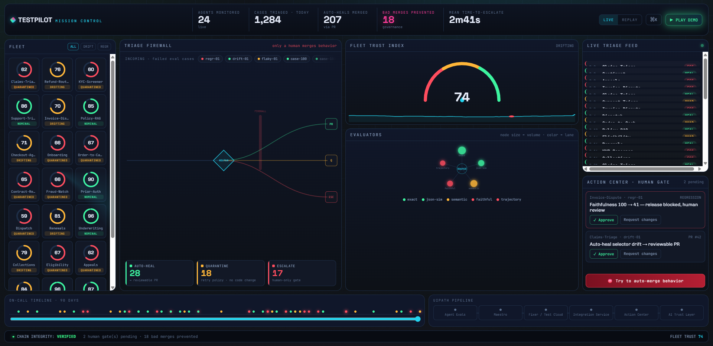
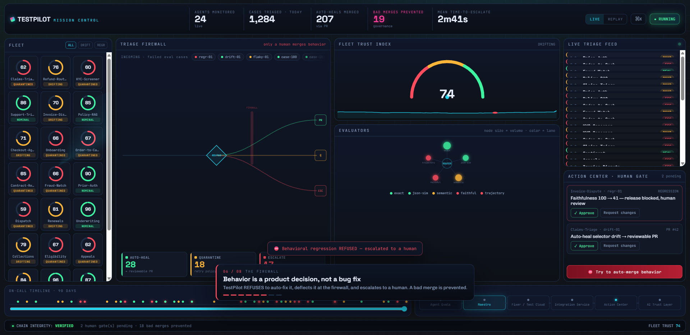

# TestPilot — the on-call QA engineer for AI agents

> An agentic, governed quality gate that treats AI agents as first-class software-under-test.

Everyone is shipping AI agents. Almost nobody has a **governed** way to catch when an agent has *silently regressed* — when its **behavior** drifted, not its code. Self-healing selectors is a solved commodity; **governing agent quality is not.**

TestPilot runs on **UiPath Maestro** and treats a failed **Agent Evaluation** run as the thing to triage. It classifies each failing case by *which evaluator class* failed and applies a **policy-correct action** to each:

| Bucket | Signal | Action |
|---|---|---|
| **Mechanical drift** | Deterministic *exact-match / JSON-similarity* fails (a tool selector / output-schema field was renamed) | **Auto-heal** → one-line diff → re-run → **reviewable GitHub PR** for human approval |
| **Flaky** | A behavioral-class evaluator **passes on retry** (genuine non-determinism) | **Quarantine** with a retry policy; no code change |
| **Behavioral regression** | *LLM-as-Judge faithfulness* / *Trajectory* fails **consistently** (the agent's behavior actually changed) | **Never auto-fixed** → escalate to a human (Action Center + Slack) with an AI root-cause summary |

**The load-bearing policy:** *a behavioral change in an agent is a product decision, not a bug fix — only a human merges behavior.* It is enforced in **code** (the severity-priority router sends any behavioral regression to a human, and the fixer refuses any non-mechanical case), not merely narrated.

## Live demo — Mission Control

A real-time ops room for **agent trust**: a 24-agent fleet, the **Triage Firewall** (watch a behavioral regression get *deflected* — never auto-merged), a fleet-trust gauge, the evaluator constellation, a live triage feed, the **Action Center human gate**, and a **hash-chained governance ledger** you can tamper with to prove it's tamper-evident.



```bash
python -m http.server 8139 --directory dashboard
# open http://localhost:8139/  →  click ▶ PLAY DEMO
```

**▶ PLAY DEMO is fully narrated** — a guided 8-beat story walks any viewer from the red eval run → mechanical-drift auto-heal → flaky quarantine → the **firewall deflecting a behavioral regression** → the human's evidence packet → the tamper-evident ledger. The value lands in ~30 seconds with zero explanation needed.



The whole policy soul in one gesture: press **“Try to auto-merge behavior”** and the system slams a **DENIED** stamp and logs it — *behavior is a product decision, not a bug fix.*

**Verified end-to-end** with a runnable Playwright smoke test ([`dashboard/tp.spec.mjs`](dashboard/tp.spec.mjs)): a behavioral-regression packet ticks *BAD MERGES PREVENTED*, writes a `REFUSED auto-fix` block, and the chain stays `VERIFIED`; press-to-be-DENIED logs a `BLOCKED` block; tampering with the ledger breaks the chain and reverting restores it.

```bash
cd dashboard && npm i -D @playwright/test && npx playwright install chromium
npx playwright test            # 3 passed
```

> A minimal, dependency-free **static verdict card** (`dashboard/simple.html`) is also rendered straight from live pipeline output by `python scripts/build_dashboard.py` — a lightweight, zero-JS fallback.

## How it works

```
Agent Evaluation run (red)  ──►  Maestro BPMN process
                                   ├─ Triage agent  (classify each case by evaluator class)
                                   └─ Exclusive gateway on the build verdict (severity priority)
                                        ├─ MECHANICAL_DRIFT  →  Fixer agent → branch → Test-Manager re-run → GitHub PR → Action Center approval
                                        ├─ FLAKY             →  quarantine + retry policy
                                        └─ BEHAVIORAL_REGR.  →  Action Center task + Slack (AI root-cause); never auto-fixed
```

Try the whole flow offline — no tenant, no network:

```bash
python -m venv .venv && ./.venv/Scripts/python -m pip install -e ".[dev]"
./.venv/Scripts/python -m pytest          # 83 tests, all green
./.venv/Scripts/python scripts/demo.py    # routes the seeded 3-case run through all branches
```

## UiPath components used

- **UiPath Maestro** (BPMN agentic process) — durable orchestration, exclusive gateway, Execution Trail (pause/resume/retry).
- **Agent Builder** — the low-code **Triage** agent.
- **Coded Agents** (Python, on serverless) — the **Fixer** agent.
- **Agent Evaluations** — Deterministic / LLM-as-Judge / Trajectory evaluators as the test substrate.
- **UiPath Test Cloud / Test Manager** — coded test case execution + the red→green re-run (`uipcli test run --projectKey`).
- **Integration Service** — GitHub (Pull Request) + Slack (message).
- **Action Center** — human-in-the-loop approval / review.
- **AI Trust Layer — LLM Gateway** — the runtime LLM for the fixer (keyless, governed).

**Agent type:** **combination** — a low-code Agent Builder triage agent **+** a Python coded fixer agent. The fixer drafts its one-line diff via the **UiPath AI Trust Layer LLM Gateway** (keyless, governed) — an "agent uses an LLM" design choice behind an injected `LLMClient` Protocol, so the whole pipeline is unit-tested offline.

## Repository layout

```
src/testpilot/        # the agent brains (pure, unit-tested)
  models.py · triage_classifier.py · eval_result_parser.py · selector_fixer.py
  git_pr_runner.py · escalation_payload_builder.py · llm.py · pipeline.py
agents/triage/        # UiPath coded agent — main.py + uipath.json
agents/fixer/         # UiPath coded agent — main.py + uipath.json
dashboard/            # Mission Control UI (index.html · app.js · styles.css · fleet.json) + tp.spec.mjs
tests/                # 83 tests (unit + contract + integration smoke); fixtures/ = deterministic seed
scripts/              # demo.py (offline 3-branch rehearsal) · build_dashboard.py (static card) · gen_fleet_data.py
docs/                 # SYSTEM-DESIGN · CLOUD-RUNBOOK
```

## Quality

- **Strict TDD** — every module written test-first (red → green → refactor). **83 tests** pass offline in <1s; the Mission Control UI has its own runnable **Playwright** smoke test (3 passing).
- **Contract test** guards the Maestro↔agent field-name mapping against silent drift.
- **CI** (GitHub Actions) runs the full test suite on every push.
- Guardrails encoded in code: behavior is never auto-fixed (two independent checks), no empty/garbage PRs, secrets never on `argv`.

## Setup & prerequisites

**Offline (the Python core + demo):** Python 3.11+, then the commands above.
**On UiPath (the running solution):** an Automation Cloud (Agentic) tenant with Maestro, coded-agents-on-serverless, Agent Evaluations, Integration Service (GitHub + Slack), Action Center, and Test Manager; an External Application with scopes `OR.Folders OR.Execution TM.Projects TM.TestSets TM.TestExecutions`. Publish the agents with `uipath init && uipath pack && uipath publish`. Full runbook in [`docs/SYSTEM-DESIGN.md`](docs/SYSTEM-DESIGN.md) §11/§14.

## Docs
[System Design](docs/SYSTEM-DESIGN.md) · [Cloud Runbook](docs/CLOUD-RUNBOOK.md)

---
_License: **MIT**. All test data is **synthetic** — no PHI, no customer data._
