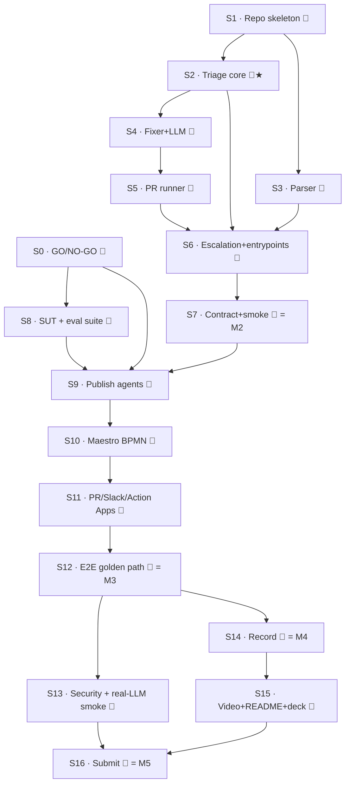

# TestPilot — Execution Plan (Phases & Sprints)
### The whole build, broken down · companion to [TESTPILOT-PLAN.md](TESTPILOT-PLAN.md) + [SYSTEM-DESIGN.md](SYSTEM-DESIGN.md)

This is the work breakdown we execute **when you say go**. It turns the design into ordered, time-boxed sprints with explicit owners, dependencies, and a Definition of Done (DoD) per sprint.

## How to read this

- **Owner:** 🤖 = Claude (Lane B — offline Python, strict TDD) · 🧑 = You (Lane A — UiPath cloud click-path; I supply exact specs/steps) · 🤝 = Joint (integration, demo, submission).
- **Sprint = a closed, demoable unit of work** with a hard DoD. A sprint isn't "done" until its DoD is green.
- **Phases** group sprints by stage of the build. **Milestones (M1–M5)** are the go/no-go checkpoints.
- **Gate** = a blocking condition that must pass before dependent sprints start.

---

## Milestone map

| # | Milestone | Reached at | Meaning |
|---|---|---|---|
| **M1** | **Foundation ready** | end of Sprint 0–1 | Tenant entitlements proven (GO/NO-GO) + repo skeleton live |
| **M2** | **Core engine green** | end of Sprint 7 | Entire Lane-B Python core TDD-green offline (the agent brains) |
| **M3** | **First end-to-end on platform** | end of Sprint 12 | A seeded run flows through Maestro → all 3 branches on Automation Cloud |
| **M4** | **Demo recorded** | end of Sprint 14 | Clean raw footage of the golden path captured (the "it RUNS" insurance) |
| **M5** | **Submitted** | end of Sprint 16 | Devpost entry complete before **Jun 29, 11:45 pm EDT** |

---

## Phase & sprint overview

| Sprint | Phase | Owner | Goal | Depends on | Est | M |
|---|---|---|---|---|---|---|
| **S0** | 0 · Foundations | 🧑 | Provisioning **GO/NO-GO** gate | — | 2h | M1 |
| **S1** | 0 · Foundations | 🤖 | Repo skeleton + fixtures + CI/secrets guard | — | 1.5h | M1 |
| **S2** | 1 · Core Engine | 🤖 | Triage classifier + severity-priority (the wedge) | S1 | 2h | |
| **S3** | 1 · Core Engine | 🤖 | Eval/JUnit parser | S1 | 1.5h | |
| **S4** | 1 · Core Engine | 🤖 | Selector fixer + LLM client + edge guards | S2 | 2.5h | |
| **S5** | 1 · Core Engine | 🤖 | Git/PR runner + CLI argv builder | S4 | 2h | |
| **S6** | 1 · Core Engine | 🤖 | Escalation builder + 2 agent entrypoints (lazy) | S2,S3,S5 | 2h | |
| **S7** | 1 · Core Engine | 🤖 | Contract test + 3-branch integration smoke | S6 | 2h | **M2** |
| **S8** | 2 · Cloud Wiring | 🧑 | SUT agent + Agent-Eval suite + seed the drift | S0 | 3h | |
| **S9** | 2 · Cloud Wiring | 🤝 | Publish triage + fixer agents to serverless | S0,S7,S8 | 2h | |
| **S10** | 2 · Cloud Wiring | 🧑 | Maestro BPMN (start→triage→gateway→3 branches) | S9 | 3h | |
| **S11** | 2 · Cloud Wiring | 🤝 | gh-CLI PR + Slack + 2 Action Apps (HITL) | S10 | 3h | |
| **S12** | 3 · Integration | 🤝 | End-to-end golden path + Test-Mgr re-run + durability | S11 | 3h | **M3** |
| **S13** | 3 · Integration | 🤝 | Security hardening + real-LLM smoke pinned | S12 | 2h | |
| **S14** | 4 · Demo/Submit | 🤝 | Record golden path (raw footage, all branches) | S12 | 2h | **M4** |
| **S15** | 4 · Demo/Submit | 🤖🤝 | Edit <5-min video + README + deck | S14 | 4h | |
| **S16** | 4 · Demo/Submit | 🤝 | Bonus evidence on camera + Devpost submit | S13,S15 | 2h | **M5** |

> **Parallelism (key to fitting 3 days):** once **S0 passes**, Lane A (S8→S11, 🧑) and Lane B (S2→S7, 🤖) run **in parallel** — I build the brains offline while you stand up the platform. They converge at **S9** (publish) and **S12** (end-to-end).

---

## Dependency & parallelization view

**Critical path:** S0 → S8 → S9 → S10 → S11 → S12 → S14 → S15 → S16. (Lane B S1–S7 must finish before S9, but runs parallel to S8 so it isn't on the critical path if it keeps pace.)

---

# PHASE 0 — Foundations  *(Day 0 · ~3h · unblocks everything)*

### Sprint S0 — Provisioning GO/NO-GO  🧑  *(blocking gate, M1)*
**Goal:** prove the platform can host the build before a line of orchestration is written.
**Tasks:**
1. Provision the **Agentic trial** on Automation Cloud; submit the **Test Cloud** sales request in parallel.
2. Register **one External Application** (confidential) with scopes `OR.Folders OR.Execution TM.Projects TM.TestSets TM.TestExecutions`; save ClientId/Secret to a Credential Asset (not the repo).
3. Confirm an unattended runtime / machine template exists in the target folder (Maestro prerequisite).
4. **Proof of life:** publish a hello-world **coded agent to serverless** AND a 1-node **Maestro** process that calls it.
**DoD:** a written GO/NO-GO note confirming **Maestro · serverless-publish · Test Manager · Integration Service · Action Center · Agent Evaluations** are all live, External App registered.
**If NO-GO:** pivot to the Orchestrator long-running fallback (see PLAN §10) before any BPMN work.

### Sprint S1 — Repo skeleton + guards  🤖  *(M1)*  ·  *(head-start already on disk)*
**Goal:** a clean, test-runnable repo with security rails from commit #1.
**Tasks:** git init; `pyproject.toml` (pytest `pythonpath=src`); `LICENSE` (MIT); `.gitignore`; `.env.example` (placeholders only); README stub + **bonus two-column wall**; commit the **reconciled fixtures** (`seed_all/drift/flaky/regr.json`, `junit_red/green.xml`, `sample_repo/.../CheckoutTest.cs`); add **gitleaks pre-commit + CI** and a pytest CI workflow.
**DoD:** `pytest` runs (collects, red OK); gitleaks green; first commit pushed to the public repo.

---

# PHASE 1 — Core Engine (Lane B · offline · strict TDD)  *(Day 1 · ~12h · → M2)*

> Every sprint here is **red → green → refactor**. DoD always includes "new tests written first, watched fail, then green; full suite green; no warnings."

### Sprint S2 — Triage classifier + severity priority  🤖 ★ *(the wedge)*
**Build:** `models.py` (enums, `EvalResult`, `Classification`) · `triage_classifier.py` (`classify`, `select_primary_category`).
**Tests (first):** evaluator-class → category for all 5 types; passed-on-retry → FLAKY; unknown → `ValueError`; confidence == 1.0; **priority BEHAVIORAL > MECHANICAL > FLAKY**; empty → raise.
**DoD:** ~12 tests green; the never-auto-fix-behavior routing is proven in code.

### Sprint S3 — Eval/JUnit parser  🤖
**Build:** `eval_result_parser.py` (`parse_eval_results`, `parse_junit`, `is_green`).
**Tests (first):** seed JSON → 3 `EvalResult` with correct types; `evaluator_type` trusted, label→enum fallback only when absent; junit red/green; `is_green` = failures==0 & tests>0; malformed JSON/XML → `ParseError` (never empty-success).
**DoD:** parser tests green; all fixtures parse.

### Sprint S4 — Selector fixer + LLM client  🤖
**Build:** `llm.py` (`LLMClient` Protocol, `UiPathLLMGatewayClient` stub, `FakeLLM`) · `selector_fixer.py` (`draft_fix`).
**Tests (first):** locates the `actual` token line; one-line diff; **reject** multiline / code-fenced / empty / whitespace-only / no-op / out-of-repo path → `FixerError`; Anthropic/Gateway payload shape (mocked).
**DoD:** fixer tests green offline with `FakeLLM`; no network.

### Sprint S5 — Git/PR runner  🤖
**Build:** `git_pr_runner.py` (`apply_and_branch`→`CommitResult`, `build_rerun_cmd`).
**Tests (first):** one-line change on disk; deterministic branch `fix/drift-01`; commit msg has `Co-Authored-By: Claude`; **argv carries no secret literal** (env-ref only); flag-**set** membership (deferred-deep until CLI verified Day-1).
**DoD:** runner tests green with `FakeCmdRunner`.

### Sprint S6 — Escalation + agent entrypoints  🤖
**Build:** `escalation_payload_builder.py` (`build_regression_summary`, `build_quarantine_note`) · `agents/triage/main.py` · `agents/fixer/main.py`.
**Tests (first):** summary contains the never-auto-fix policy line + dropped score + trajectory (slack ≤4000); behavioral→quarantine raises; entrypoints return JSON-roundtrippable output with exact field names; fixer entrypoint **rejects non-mechanical** input; **clients built lazily** (import with empty env succeeds).
**DoD:** tests green; `python -c "import agents.triage.main"` works with empty env.

### Sprint S7 — Contract + integration smoke  🤖 *(M2)*
**Build:** golden `tests/fixtures/entry-points.json` + `maestro-mapping.json` · `test_contract.py` · `test_integration_smoke.py`.
**Tests (first):** contract diff of agent output names (snake) vs Maestro mapping (camel) with case-normalization; 3-branch smoke from `seed_all.json` → {FixProposal, QuarantineNote, RootCauseSummary}; applied-fix → green-JUnit assertion.
**DoD:** **entire suite green** → **M2: the agent brains are done & verified offline.**

---

# PHASE 2 — On-Platform Wiring (Lane A)  *(Day 1 PM–Day 2 · parallel to Phase 1 after S0)*

### Sprint S8 — SUT agent + Agent-Eval suite  🧑
**Goal:** a real failing agentic eval run to triage.
**Tasks:** build a tiny **system-under-test agent** (low-code Agent Builder); attach an **Agent Evaluations** suite spanning evaluator classes (Exact/JSON = deterministic; Semantic; LLM-Judge/Trajectory); seed a mechanical drift; **capture** the failing eval JSON → reconcile to `seed_*.json`.
**DoD:** a reproducible failing eval run captured and pinned.

### Sprint S9 — Publish coded agents  🤝
**Tasks:** `uipath auth → init → pack → publish` triage + fixer to serverless; verify invocable as Maestro service tasks; **diff the real `entry-points.json` against the golden** (contract test).
**DoD:** both agents live on serverless; contract test passes against the real publish.

### Sprint S10 — Maestro BPMN  🧑
**Tasks:** build Start(None/Timer, seeded `evalResultJson`) → Triage service task → **exclusive gateway** `vars.primaryCategory == ...` with **explicit default → Error end** → Branches A/B/C → 3 Ends; wire every `Output>Response` mapping (all vars String; `classifications` as JSON string).
**DoD:** a seeded instance runs; the gateway routes each single-case seed to its branch.

### Sprint S11 — PR + Slack + Action Apps  🤝
**Tasks:** open the PR via **`gh` inside the fixer agent** (fine-grained single-repo token as Credential Asset); **Slack** Send-Message; build **2 Action Apps** (approve-PR, review-regression) + wire to User tasks; read decision via `hitlTask`.
**DoD:** Branch A → real PR + Action Center approval; Branch C → Action Center task + Slack message; Branch B → quarantine note.

---

# PHASE 3 — Integration & Hardening  *(Day 2 · → M3)*

### Sprint S12 — End-to-end golden path  🤝 *(M3)*
**Tasks:** run the full instance; **Test Manager re-run** via corrected `uipcli` flags + 5 scopes → JUnit red→green (or fixture-driven flip); demonstrate **Execution Trail** pause/resume/retry-from-failed-task.
**DoD:** all 3 branches + durability proven on the tenant → **M3.**

### Sprint S13 — Security + real-LLM smoke  🤝
**Tasks:** confirm **branch protection** on `main` (require PR + 1 human reviewer); gitleaks CI green; scrub secrets from any on-camera surface; run **one real LLM-Gateway call** through `selector_fixer` and pin prompt+response to `docs/llm-smoke.md`.
**DoD:** security gates green; the on-camera "AI drafts the fix" moment is real and pinned.

---

# PHASE 4 — Demo & Submission  *(Day 2 night–Day 3 · → M4/M5)*

### Sprint S14 — Record golden path  🤝 *(M4)*
**Tasks:** capture **raw footage** of the full 6-beat demo (hook → triage → Branch A PR → Branch C human → Branch B + durability → bonus terminal). Record **end of Day 2** so a Day-3 hiccup can't cost the "it RUNS" moment.
**DoD:** clean raw recording of every beat in hand → **M4.**

### Sprint S15 — Edit video + README + deck  🤖🤝
**Tasks:**
- **Video** (<5:00, YouTube/Vimeo/Youku): show it RUNNING on Automation Cloud, walk the architecture, name the agents + how Maestro orchestrates them, show the human gate. **No copyrighted music / third-party trademarks; English.**
- **README** must include: what it does + problem · **comprehensive UiPath components list** · an **explicit agent-type declaration** — *"combination: low-code Agent Builder triage agent + Python coded fixer agent; built with Claude Code (UiPath for Coding Agents)"* · **detailed step-by-step setup + prerequisites** · reproducible CLI · citations · the **bonus two-column wall**.
- **Deck** — **must use the provided template** (`bit.ly/3R0MsHU`); fill problem/wedge/architecture/rubric-map/roadmap; host on Drive/OneDrive/Dropbox **shared "access to all"**.
**DoD:** video uploaded; README has all mandatory sections incl. agent-type line; deck on the provided template + access-to-all.

### Sprint S16 — Bonus evidence + submit  🤝 *(M5)*
**Tasks:**
- Bonus on camera: `uip login` + `uip skills install --agent claude` + Claude Code driving `uip pack/publish`; save `docs/agent-sessions/` + `CLAUDE-GENERATED.md`; mirror the bonus block into the **Devpost description** (rules accept README *or* description — do both).
- **Devpost project page:** title · **select Track 3** · text description (features, business problem, how it works) · **screenshots/images**.
- Complete the **feedback form**; final repo polish; submit with all links (repo, video, deck).
**DoD:** **Devpost submission complete before Jun 29, 11:45 pm EDT** → **M5.** Run the [COMPLIANCE-CHECKLIST](COMPLIANCE-CHECKLIST.md) §G day-of QA first.

---

## Definition-of-Done conventions
- **Code sprints:** tests written first → watched fail → minimal green → refactor; full suite green; no warnings; committed with `Co-Authored-By: Claude` where Claude Code authored it.
- **Cloud sprints:** the step is demonstrated running on the tenant (screenshot/recording), not just configured.
- **No silent caps:** anything narrated-not-built (e.g., Branch B from a screenshot) is labeled as such.

## Backlog — full-product stretch (only after M3 is green; priority order)
1. Real **Test Cloud** App-Testing-Robot execution on camera (branding + strongest "running" proof).
2. **Live webhook auto-trigger** (Orchestrator `job.completed` → Integration Service HTTP Webhook → Maestro Message start).
3. **Per-case looping** in one Maestro instance (process all failing cases in a single run).
4. **AI Trust Layer governance policy** (PII masking + LLM audit log on the triage agent).
5. Lightweight **ops dashboard** (cosmetic; native Execution Trail is the real one).

## Gates (do not skip)
- **G1 (before S8–S11):** S0 GO/NO-GO must pass.
- **G2 (before S7 smoke):** §14.1–§14.3 contract fixes landed (already in the design).
- **G3 (before S14 record):** contract test green against the *real* publish (S9).
- **G4 (before submit, S16):** [COMPLIANCE-CHECKLIST](COMPLIANCE-CHECKLIST.md) §G day-of QA all checked.

## Compliance anchors (woven into the sprints)
- **Studio Web + Automation Cloud (DQ trigger):** author the Maestro process **in Studio Web** and create/register the coded agents as Studio Web / Automation Cloud projects (S8–S10); state this in the README. Local Python authoring + `uip publish` is allowed ("incorporate pre-existing code") — but the build must be anchored on-platform.
- **Track-3 fit:** foreground **Test Cloud / Test Manager** (the coded test executing, red→green) in both the demo and README — not just Agent Evaluations + Maestro.

## Post-submission & live round 🕓 *(after M5)*
- **Finalist (if selected):** publishing the solution as a **Use Case on the UiPath Community Forum is mandatory** to remain prize-eligible.
- **Phase 2:** live **Zoom presentation + Q&A** (Presentation criterion). Rehearse the deck talk; prep Q&A on the wedge, the never-auto-fix policy, platform depth, and feasibility.
