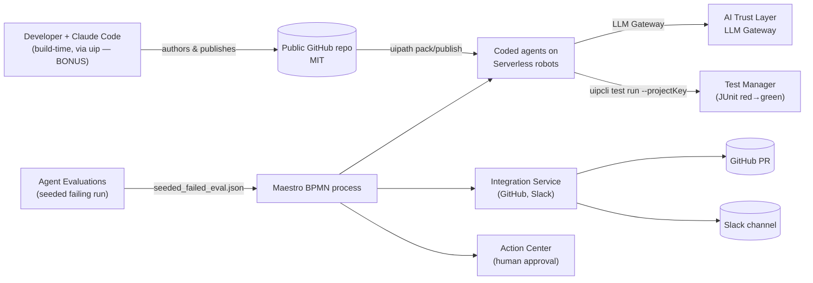
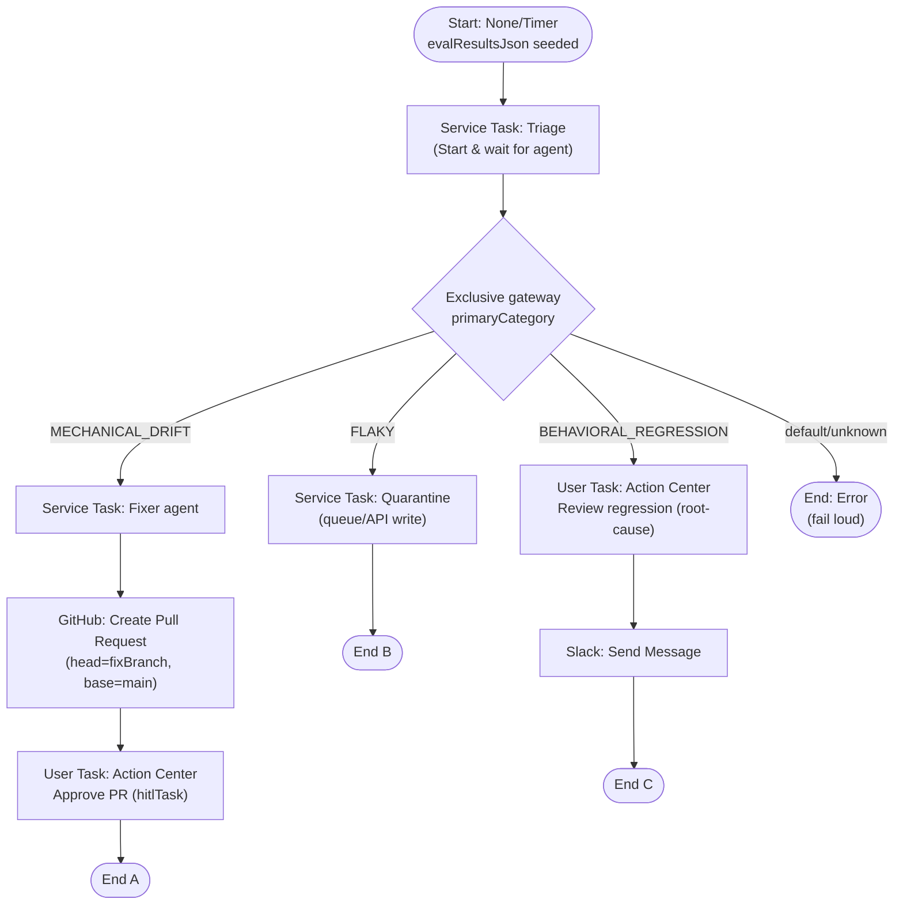
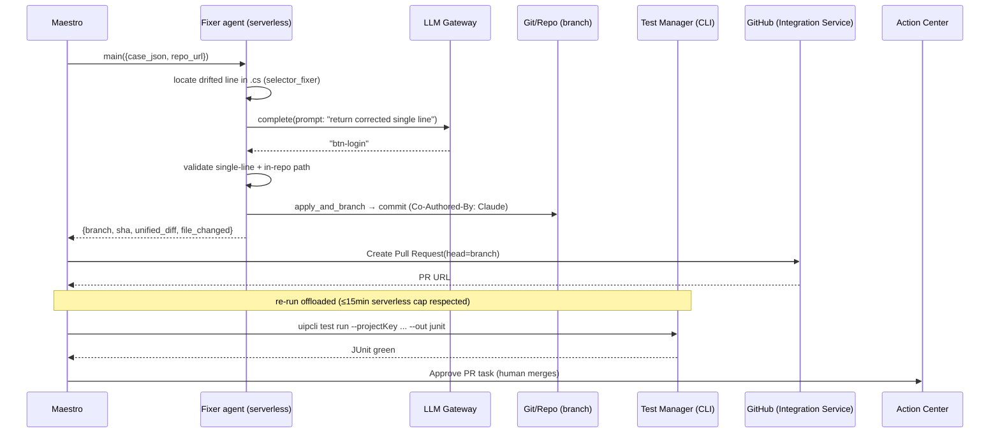
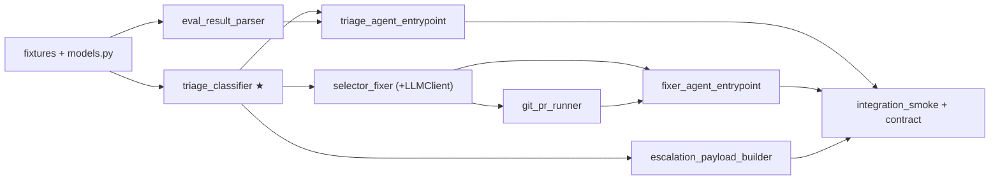

# TestPilot — System Design & Architecture
### Companion to [TESTPILOT-PLAN.md](TESTPILOT-PLAN.md) · the build-ready specification

This document is the **execution contract**: every data shape, interface, mapping, and failure mode pinned down so the build is mechanical. Where something must be verified against the live tenant before relying on it, it's marked **⚠️ VERIFY (Day 1)**.

---

## 1. System context



**Trust boundaries:** secrets (External-App ClientId/Secret, connector OAuth tokens) live **only** in UiPath; the runtime LLM call goes through the **LLM Gateway** (no Anthropic key in our code); the repo holds **no secrets** and **no PHI** (synthetic fixtures only).

---

## 2. Domain model (single source of truth)

All models are `pydantic v2`. JSON field names are **contract-frozen** — they must match Maestro `Output>Response` mappings byte-for-byte.

```python
# src/testpilot/models.py
from enum import Enum
from pydantic import BaseModel, Field

class EvaluatorType(str, Enum):
    DETERMINISTIC_EXACT   = "deterministic_exact"     # exact-match → mechanical
    JSON_SIMILARITY       = "json_similarity"         # output-schema field drift → mechanical
    SEMANTIC_SIMILARITY   = "semantic_similarity"     # fuzzy text → flaky-capable
    LLM_JUDGE_FAITHFULNESS= "llm_judge_faithfulness"  # behavior → behavioral
    TRAJECTORY            = "trajectory"              # tool-path → behavioral

class Category(str, Enum):
    MECHANICAL_DRIFT      = "MECHANICAL_DRIFT"
    FLAKY                 = "FLAKY"
    BEHAVIORAL_REGRESSION = "BEHAVIORAL_REGRESSION"

class EvalResult(BaseModel):
    case_id: str
    evaluator_type: EvaluatorType
    evaluator_name: str                 # raw UiPath label, e.g. "Exact match" (mapped on parse)
    score: int = Field(ge=0, le=100)
    passed_on_retry: bool = False
    retry_count: int = 1
    expected: str | None = None
    actual: str | None = None
    trajectory_diff: str | None = None  # e.g. "step 3: expected ToolA, got ToolB"

class Classification(BaseModel):
    case_id: str
    category: Category
    reason: str
    confidence: float = Field(ge=0.0, le=1.0)

class FixProposal(BaseModel):
    file_path: str       # repo-relative, must resolve under repo_root
    old_line: str
    new_line: str
    unified_diff: str    # exactly one '-' and one '+' content line

class JUnitReport(BaseModel):
    tests: int
    failures: int
    cases: list[dict]    # [{name:str, passed:bool}]

class RootCauseSummary(BaseModel):
    title: str
    body_markdown: str   # contains the never-auto-fix policy line
    slack_text: str      # <= 4000 chars

class QuarantineNote(BaseModel):
    case_id: str
    action: str = "quarantine"
    retry_policy: dict   # {max_retries:int, backoff:str}
```

**Classification rule (the wedge, as a decision table):**

| evaluator_type | passed_on_retry | → category |
|---|---|---|
| `deterministic_exact` / `json_similarity` | any | **MECHANICAL_DRIFT** |
| `semantic_similarity` / `llm_judge_faithfulness` / `trajectory` | **true** | **FLAKY** |
| `semantic_similarity` / `llm_judge_faithfulness` / `trajectory` | **false** | **BEHAVIORAL_REGRESSION** |
| anything unknown | — | **raise `ValueError`** (fail loud — never silently route to auto-fix) |

> Guardrail encoded in code, not just narration: a `BEHAVIORAL_REGRESSION` can **never** reach the fixer (`fixer_agent_entrypoint` raises on non-mechanical input) and can **never** produce a quarantine note (`build_quarantine_note` raises on a behavioral case).

---

## 3. Maestro↔agent I/O contracts (the silent-failure trap, pinned)

### Triage agent (`agents/triage/main.py`)
```
Input  (dataclass)  : { "eval_results_json": str }          # seeded JSON string
Output (dataclass)  : { "classifications": list[dict],       # [Classification.model_dump(), ...]
                        "primary_category": str }            # the bucket the gateway switches on
uipath.json         : { "functions": { "main": "agents/triage/main.py:main" } }
```

### Fixer agent (`agents/fixer/main.py`)
```
Input  (dataclass)  : { "case_json": str, "repo_url": str }  # one MECHANICAL_DRIFT Classification + repo
Output (dataclass)  : { "branch": str, "sha": str,
                        "unified_diff": str, "file_changed": str }
uipath.json         : { "functions": { "main": "agents/fixer/main.py:main" } }
```

### Maestro process-variable ↔ field mapping
| Maestro process variable | Direction | Agent field | Notes |
|---|---|---|---|
| `evalResultsJson` (String) | → Triage In | `eval_results_json` | seeded at start |
| `classifications` (String/JSON) | ← Triage Out | `classifications` | array of Classification |
| `primaryCategory` (String) | ← Triage Out | `primary_category` | **gateway switch** |
| `caseJson` (String) | → Fixer In | `case_json` | the drift Classification |
| `repoUrl` (String) | → Fixer In | `repo_url` | constant |
| `fixBranch` (String) | ← Fixer Out | `branch` | → GitHub PR `head` |
| `unifiedDiff` (String) | ← Fixer Out | `unified_diff` | → PR body + AC task |
| `fileChanged` (String) | ← Fixer Out | `file_changed` | → PR title |

> **Contract test** (`tests/test_contract.py`) parses each published agent's `entry-points.json` and asserts its field names equal this table — run it **before every recording**.

---

## 4. Maestro BPMN process design



**Gateway conditions** (string equality on `primaryCategory`): `== "MECHANICAL_DRIFT"` → A; `== "FLAKY"` → B; `== "BEHAVIORAL_REGRESSION"` → C; otherwise → Error end. **Durability:** the Execution Trail (pause/resume/retry-from-failed-task) is demonstrated on a live instance — the governance proof.

---

## 5. Branch A sequence (the spine, end-to-end)



**15-min budget:** the agent call does **draft+commit only**; the CLI re-run is a separate step. For the deterministic demo the red→green flip is driven from `junit_red.xml`→`junit_green.xml` fixtures shown alongside the live CLI invocation (decouples the visual from execution timing).

---

## 6. Runtime LLM — LLM Gateway integration

```python
# src/testpilot/llm.py
from typing import Protocol

class LLMClient(Protocol):
    def complete(self, prompt: str) -> str: ...

class UiPathLLMGatewayClient:          # PRIMARY — governed, no key (⚠️ VERIFY exact SDK call Day 1)
    """Wraps the UiPath AI Trust Layer LLM Gateway via the uipath SDK."""
    def __init__(self, model: str = "anthropic.claude-*"): ...
    def complete(self, prompt: str) -> str: ...

class BedrockClient:                    # FALLBACK — your AWS account (Anthropic Claude on Bedrock)
    def complete(self, prompt: str) -> str: ...

class FakeLLM:                          # TESTS — returns a canned single line; zero network
    def __init__(self, reply: str): self._r = reply
    def complete(self, prompt: str) -> str: return self._r
```

**Fix prompt template (one-line diff only):**
```
SYSTEM: You repair a single drifted locator/field string in a UiPath coded test.
Return ONLY the corrected line — no prose, no code fences, no extra lines.
USER: File: {file_path}
Failing case: {reason}
Current line:
{old_line}
The locator/field above no longer matches the application. Return the corrected single line.
```
**Output guardrails (in `selector_fixer`, enforced by tests):** reject multi-line output; the corrected line must differ by exactly the changed token; `file_path` must resolve under `repo_root`; the original string must exist in the file (else `FixerError`). The client is **injected**, so the entire module is unit-tested offline with `FakeLLM`; a **single real-LLM smoke** (Day 2 H0) pins the live prompt+response in `docs/llm-smoke.md`.

---

## 7. Fixtures (the deterministic spine — committed first)

`tests/fixtures/seeded_failed_eval.json`
```json
[
  {"case_id":"drift-01","evaluator_type":"deterministic_exact","evaluator_name":"Exact match",
   "score":0,"passed_on_retry":false,"retry_count":1,
   "expected":"orderId","actual":"order_id"},
  {"case_id":"flaky-01","evaluator_type":"semantic_similarity","evaluator_name":"Semantic similarity",
   "score":88,"passed_on_retry":true,"retry_count":2},
  {"case_id":"regr-01","evaluator_type":"llm_judge_faithfulness","evaluator_name":"Faithfulness",
   "score":41,"passed_on_retry":false,"retry_count":3,
   "trajectory_diff":"step 3: expected lookup_policy, got summarize"}
]
```
`tests/fixtures/sample_repo/UiTests/CheckoutTest.cs` (the drift lives in a plain-text inline string — guaranteed one-line diff):
```csharp
// ... Arrange-Act-Assert coded test ...
var submit = screen.FindElement("btn-signin");   // drifted: was "btn-login"
```
`junit_red.xml` (failures=1) / `junit_green.xml` (failures=0) — minimal valid JUnit.

---

## 8. Error handling & failure semantics

| Component | Raises on | Maestro/runtime behavior |
|---|---|---|
| `triage_classifier` | unknown evaluator | propagates → triage agent fails → Maestro **retry-from-failed-task** (never silent mis-route) |
| `eval_result_parser` | malformed JSON/XML, missing testsuite | `ParseError` (never return empty = "no failures") |
| `selector_fixer` | multi-line LLM output, out-of-repo path, string absent | `FixerError` → no PR opened (never an empty/garbage PR) |
| `fixer_agent_entrypoint` | non-MECHANICAL case_json | raises (**behavior is never auto-fixed in code**) |
| `build_quarantine_note` | BEHAVIORAL case | `ValueError` (can't accidentally quarantine a real regression) |
| serverless agent | >15 min | hard-kill → keep calls short (draft+commit only) |
| connector OAuth | token failure | **fallback**: `gh` CLI PR + Slack webhook (pre-wired in `git_pr_runner` from day 1) |

---

## 9. Test strategy matrix

| Layer | Scope | Tooling | Gate |
|---|---|---|---|
| **Unit (TDD)** | 5 pure modules | pytest + FakeLLM/FakeCmdRunner | red→green→refactor; offline; CI |
| **Contract** | agent `entry-points.json` ↔ Maestro mapping (§3) | pytest reads published JSON | **before every recording** |
| **Integration smoke** | parser→classifier→fixer→runner over seeded 3 cases | pytest, no network | mirrors the 3-branch demo; regression guard |
| **Real-LLM smoke** | one live `selector_fixer` call | manual, pinned to `docs/` | proves the on-camera moment |
| **Cloud/manual** | Maestro run, PR, Action Center, CLI re-run | the live demo | the "it RUNS" proof |

Target: pure modules ~100% branch coverage; `triage_classifier` is the highest-value suite (the wedge).

---

## 10. Build order (dependency graph) — Lane B


Build left→right, TDD each node to green before the next. `triage_classifier` (★, the wedge) first.

---

## 11. Deployment runbook (Lane A glue)

1. `uipath auth` (or `uip login`) against the Agentic trial tenant.
2. Register **External Application** (confidential) → scopes: Test Manager (execute), Orchestrator (`OR.Jobs`, folders). Save ClientId/Secret to UiPath asset / `.env` (never repo).
3. Per agent: `uipath init` → `uipath pack` → `uipath publish` to serverless. Confirm Service-task invocability.
4. Integration Service: connect **GitHub** (Create Pull Request) + **Slack** (Send Message) via OAuth. Pre-wire `gh`/webhook fallback.
5. Build Maestro BPMN per §4; wire mappings per §3; `uipath init` after every schema change.
6. Re-run path: `uipcli test run --projectKey <PK> --testsetkey <TS> --out junit -r ./out -A <acct> -I <clientId> -S <secret> --repositoryUrl/Commit/Branch` (**⚠️ VERIFY flags against installed `--help`**).
7. Bonus: `uip skills install --agent claude` (**global**, never `--local`); save session export.

---

## 12. Security, compliance & licensing
- **Secrets:** never in git. `.env.example` documents `UIPATH_*`, `AWS_*`; LLM Gateway means no `ANTHROPIC_API_KEY` needed at runtime.
- **Least privilege:** External App scoped to Test Manager + the one folder; connector tokens scoped to one repo / one channel.
- **Compliance (rules):** orchestration (Maestro), agent execution (serverless), human gate (Action Center), and the PR action (Integration Service) **all run on Automation Cloud** — the platform is load-bearing, not decorative.
- **Data:** synthetic fixtures only; no PHI, no customer data.
- **License:** MIT. **Bonus separation:** README states build-time Claude Code (bonus) vs runtime LLM Gateway (product) explicitly.

---

## 13. Self-review (this spec)
- **Placeholders:** none unresolved; live-tenant unknowns are tagged **⚠️ VERIFY (Day 1)** (exact LLM-Gateway SDK call; `uipcli` flag surface; Agent-Eval programmatic retrieval).
- **Consistency:** field names in §2/§3/§7 and the agent I/O all align; gateway switch uses `primary_category`/`primaryCategory` consistently.
- **Scope:** one implementation plan; full product with a marked spine; no unrelated work.
- **Ambiguity:** classification is a total function (unknown→raise); fixer rejects anything non-one-line/out-of-repo.

---

## 14. Readiness-Review Corrections (BINDING — supersede any conflicting detail in §1–§13)

**Verdict: GO**, conditional on (a) the Day-0 entitlement gate and (b) landing §14.1–§14.3 before the first integration smoke. Every blocker found was a specification/pinning defect, not a missing capability.

### 14.1 Fixer input contract + fixture reconciliation (the spine-killer)
- **Fixer agent In** = `{ "eval_result_json": str, "repo_url": str }` where `eval_result_json` serializes a full **EvalResult** (carries `expected`/`actual`). *(Replaces `case_json`=Classification, which lacked the drift token — selector_fixer could not locate the line.)*
- `selector_fixer.draft_fix(eval_result: EvalResult, repo_root: Path, llm: LLMClient) -> FixProposal`: locates the line containing `eval_result.actual`; LLM returns the corrected single line (uses `eval_result.expected` as the target hint); `{old_line}` = the located line.
- **Fixture reconciliation — ONE drift story across the whole spine:** `drift-01` = `{case_id:"drift-01", evaluator_type:"deterministic_exact", evaluator_name:"Exact match", score:0, passed_on_retry:false, retry_count:1, expected:"btn-login", actual:"btn-signin"}`. Its `actual` ("btn-signin") is a literal substring of `sample_repo/UiTests/CheckoutTest.cs`; the fix flips `btn-signin`→`btn-login`.
- Maestro mapping: process var `evalResultJson` (String) → Fixer In `eval_result_json`.

### 14.2 `select_primary_category` — severity priority (the policy guardrail)
- New pure function in `triage_classifier`: `select_primary_category(classifications: list[Classification]) -> Category`, strict priority **BEHAVIORAL_REGRESSION > MECHANICAL_DRIFT > FLAKY**. The triage entrypoint sets `primary_category` from it; the Maestro gateway switches on it.
- **Why:** any build containing a behavioral regression selects BEHAVIORAL → routes to the human (Branch C); it can never be auto-healed. Belt-and-suspenders: `fixer_agent_entrypoint` independently raises on non-mechanical input.
- TDD: behavioral-present→BEHAVIORAL; mechanical+flaky→MECHANICAL; flaky-only→FLAKY; empty→raise.
- **Demo routing:** each Maestro instance is seeded with ONE case (`seed_drift.json`, `seed_flaky.json`, `seed_regr.json`) so the gateway deterministically lights one branch; run three instances to show all three. `seed_all.json` (3 cases) demonstrates the build-verdict = BEHAVIORAL (release blocked). *(Per-case looping in one instance = full-product stretch.)*

### 14.3 Domain-model + parser pins
- Add **`CommitResult`** to §2: `{branch:str, sha:str, files_changed:list[str]}`.
- `Classification.confidence` = **1.0** for deterministic rule-based triage (documented; entrypoint test asserts it).
- `eval_result_parser` **trusts the provided `evaluator_type`**; `evaluator_name` is a display label only. A label→enum table (`"Exact match"→deterministic_exact`, `"JSON similarity"→json_similarity`, `"Semantic similarity"→semantic_similarity`, `"Faithfulness"→llm_judge_faithfulness`, `"Trajectory"→trajectory`) is used **only** when `evaluator_type` is absent.
- `parse_junit`: accept a `<testsuites>` or single `<testsuite>` root; `case.passed` = no `<failure>`/`<error>` child; `is_green(r)` = `r.failures==0 and r.tests>0` (errors counted as failures).

### 14.4 Test-matrix corrections
- **`selector_fixer` edge tests (add):** no-op (`old==new`)→FixerError; code-fence-wrapped→strip fences then validate else FixerError; empty/whitespace-only→FixerError.
- **Integration smoke covers ALL 3 branches** from `seed_all.json`: drift→FixProposal, flaky→QuarantineNote, regr→RootCauseSummary; **plus** one applied-fix→green-JUnit assertion (tie the applied FixProposal to `junit_green.xml`).
- **Contract test made real:** commit golden `tests/fixtures/entry-points.json` + `tests/fixtures/maestro-mapping.json` (the §3 table as data); diff agent output field names (snake_case) against the Maestro mapping (camelCase) with **case-normalization** — this catches canvas name drift. If a real Maestro export isn't available, label it honestly as a **manual pre-record checklist**, not "automated."
- **Real-LLM smoke** gated in CI behind an env flag with a pinned cassette (VCR-style).
- Defer deep `build_rerun_cmd` argv-equality tests until the CLI flag surface is verified Day 1; keep only secret-redaction + deterministic-branch-name now.

### 14.5 Cloud-lane (Lane A) reality corrections
- **Gateway:** `vars.primaryCategory == "MECHANICAL_DRIFT"` (JS-like on `vars.<name>`); explicit **default flow → Error end** (fail-loud, wired not assumed).
- **GitHub PR opened from INSIDE the fixer coded agent via `gh` CLI** (PRIMARY) — GitHub is not a confirmed native Maestro action; the Integration Service GitHub connector is alternative-to-verify Day 0. PR `head=fixBranch`, `base=main`.
- **Drop the fictional `M→TM uipcli` arrow:** the Test-Manager re-run is NOT a Maestro node. Drive red→green from `junit_red/green.xml` alongside a real off-Maestro CLI invocation. *(Stretch: wrap re-run as an API/RPA workflow invoked via a "Start and wait for API/RPA workflow" service task.)*
- **Action Center:** each User task backed by an **Action App** (build two trivial ones: approve-PR, review-regression); read the decision via the `hitlTask` output variable.
- **Entrypoints construct LLM/Cmd clients LAZILY inside `main()`** and tolerate empty env at import — `uipath init` *executes* the entrypoint to derive `entry-points.json`; import-time side effects break schema generation.
- Map all Maestro process vars as **String**; keep `classifications` a **JSON string** (parsed by the fixer) to avoid complex-type binding friction.

### 14.6 Corrected CLI + scopes (replaces §11 step 6)
```
uipcli test run <orchUrl> <tenant> --projectKey <PK> --testsetkey <TS> \
  -i ./params.json -A <org> -I <clientId> -S $UIPATH_CLIENT_SECRET \
  --applicationScope "OR.Folders OR.Execution TM.Projects TM.TestSets TM.TestExecutions" \
  -o <folder> --out junit --result_path ./out
```
- `-i` = INPUT params file (the invented `--repositoryUrl/Commit/Branch` flags are removed).
- **External App must register all five scopes** above (earlier "Test Manager execute + Orchestrator" was under-scoped → re-run 401s).
- **Secret never a literal in argv:** pass `-S $UIPATH_CLIENT_SECRET` (env ref) / Credential Asset; `build_rerun_cmd` emits the reference; redaction test asserts no secret-pattern present. *(⚠️ VERIFY exact flags against installed `--help` Day 1.)*

### 14.7 Security hardening (replaces/extends §12)
- **GitHub push credential:** a **fine-grained, single-repo, contents+pull-request-only token** as a **UiPath Credential Asset** (used by `gh` inside the fixer). **Broad PAT forbidden.**
- **Branch protection on `main`:** require PR + **1 human reviewer**, block direct push — "only a human merges behavior" is **enforced by the platform**, not narrated.
- **Secret scanning:** `gitleaks` pre-commit + CI secret scan (public repo, agent auto-commits) — green before the fixer pushes.
- **`.env.example`:** placeholder names + obviously-fake values only; **gate the runtime LLM to the Gateway path on camera** (Bedrock/direct-Anthropic = non-recorded dev fallback only → preserves the "no-key" optic).
- **Bonus integrity:** a **two-column README wall** ("build-time Claude Code = BONUS" vs "runtime LLM Gateway = PRODUCT"); ≥1 `/docs/agent-sessions/` transcript must show Claude Code issuing **`uip pack`/`uip publish`** (driving the build), not just authoring Python; Co-Authored-By trailers verifiable in CI.

### 14.8 LLM Gateway — pinned
- `UiPathLLMGatewayClient` uses the **uipath-python LLM Gateway chat-completions** service (keyless from serverless; `uipath.github.io/uipath-python/core/llm_gateway`). Pin a concrete model alias (no `anthropic.claude-*` glob). *(Confirm exact call signature Day 1.)*

