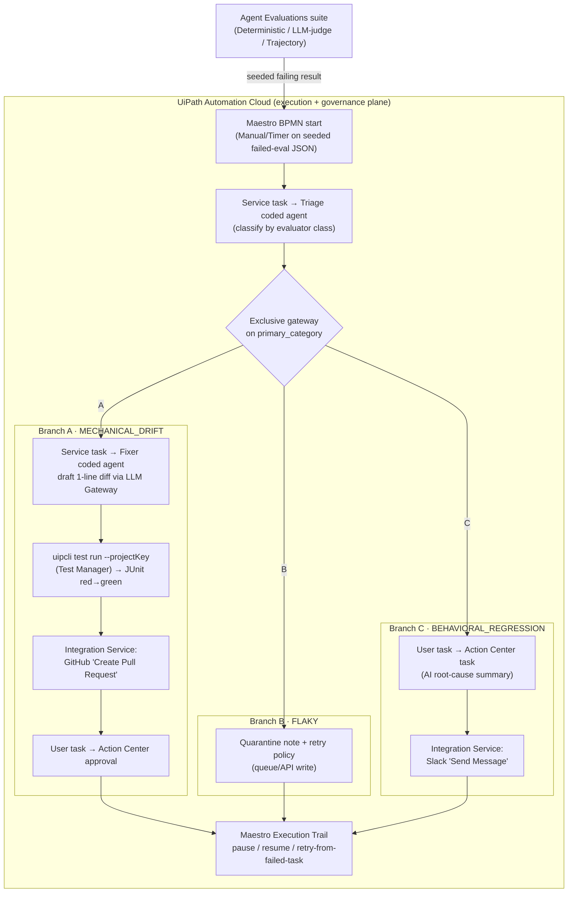

# TestPilot — Implementation & Execution Plan
### UiPath AgentHack · Track 3 (UiPath Test Cloud) · Solo build · Deadline: Mon **June 29, 2026, 11:45 pm EDT**

> **One-liner:** *TestPilot is the on-call QA engineer for AI agents.* It runs on UiPath Maestro, treats AI agents as first-class software-under-test, and triages a failed agentic regression run into three governed actions: **auto-heal** mechanical drift into a reviewable GitHub PR, **quarantine** flaky non-determinism, and **never auto-fix** a true behavioral regression — that one escalates to a human with an AI root-cause summary, all under the AI Trust Layer.

---

## 0. Why this wins (the wedge)

"Self-healing selectors" is a **solved commodity** (UiPath's own Healing Agent already votes replacement selectors at runtime; Testim/Mabl/Functionize do it too). A pure self-heal demo scores low on Creativity and looks duplicative.

The defensible, 2026-novel wedge: **an agent whose system-under-test is itself a non-deterministic AI agent**, with one load-bearing policy — **a behavioral change in an agent is a product decision, not a bug fix; only a human merges behavior.** This is exactly what Track 3 asks for ("shift quality assurance into a continuous, governed capability") and it's memorable in an *agent* hackathon. Raw selector-healing becomes just **one of three branches** — the safe, deterministic demo spine — not the headline.

Differentiation, stated explicitly for judges:
- **vs UiPath Healing Agent** — that is silent runtime first-aid on one selector. TestPilot is a governed *engineer* that triages a whole red agentic build, produces a *reviewable PR*, and refuses to auto-fix behavior.
- **vs raw UiPath Agent Evaluations** — those *score* an agent (0–100) but take no action. TestPilot *consumes* those evaluator results as its triage signal and applies a differentiated, policy-correct **action** per failure class.
- **vs commodity self-healing tools** — none treat a non-deterministic agent as the SUT, none separate flaky non-determinism from a true semantic/trajectory regression, and none enforce "a human must merge any behavioral change."

---

## 1. The 3-bucket governance model (the heart)

A failing case from an **Agent Evaluation** run is classified by **which evaluator class failed**, then routed:

| Bucket | Signal (which evaluator failed) | Action | On-platform proof |
|---|---|---|---|
| **A · MECHANICAL_DRIFT** | Deterministic *exact-match* / *JSON-similarity* fails (a tool selector or output-schema field was renamed) | **Auto-heal**: coded fixer drafts a one-line diff → branch → CLI re-run → green → **GitHub PR** for human approval | GitHub PR page + Action Center approval |
| **B · FLAKY** | Semantic-similarity / LLM-judge **passes on retry** (genuine non-determinism) | **Quarantine** with a retry/backoff policy; no code change | Queue/API write + note |
| **C · BEHAVIORAL_REGRESSION** | LLM-as-Judge *faithfulness* or *Trajectory* fails **consistently** (the agent's behavior actually changed) | **NEVER auto-fixed** → Action Center task + Slack message carrying an AI root-cause summary; a human decides | Action Center task + Slack message |

The on-camera durability/governance proof is the **Maestro Execution Trail** (pause / resume / retry-from-failed-task).

---

## 2. Locked decisions

| Decision | Choice | Rationale |
|---|---|---|
| **Track** | 3 — UiPath Test Cloud (agentic testing) | Thin field; maxes the coding-agent bonus; plays to your pro-code strength |
| **Orchestration** | Maestro **BPMN** agentic process (NOT full "Case") | Maestro *Case* still has `[Coming Soon]` pieces (case entity, role enforcement) — unsafe as a 3-day dependency. Keep "Case" as a roadmap slide → scores Platform-Usage depth |
| **Tenant** | **Agentic trial** on Automation Cloud; Test Cloud SKU = stretch | Test Cloud is **sales-gated, no self-service, no SLA** — can't be a dependency. Coded test cases + Test Manager execution + Maestro + agents + connectors + Action Center all work without the Test Cloud SKU |
| **Agents** | Python 3.12 **coded agents** (triage + fixer), packed & published to serverless | Authored-local, **runs-on-platform** = compliant + your language |
| **SUT artifact under repair** | A **plain-text one-line string in a `.cs` coded test** (an expected JSON field / inline selector literal) | Guarantees a one-line diff; sidesteps the unverified Object-Repository `.objects` on-disk format |
| **Runtime LLM (the fixer)** | **UiPath AI Trust Layer / LLM Gateway** (primary) → **Claude on AWS Bedrock** (you have AWS) → direct Anthropic API (last) | No key management, governed/audited on-platform (best optic); Bedrock as your owned fallback. **Never** the Claude Code CLI inside the 15-min serverless sandbox (unverified/unsupported) |
| **+2 bonus** | **Build-time** Claude Code via `uip skills install --agent claude` (global, never `--local`) authoring the fixer/classifier logic | The bonus is scored on *using UiPath for Coding Agents to BUILD the solution* — NOT a runtime API call. Keep the two strictly separate in README/deck |
| **Trigger** | Manual / Timer start on a **seeded failed-eval JSON** (primary) ; live webhook auto-trigger = stretch | There is **no native "Test Cloud run completed" Maestro start event** (only None/Timer/Message). Seeded start = determinism + reliability on camera |
| **Dashboard** | **None custom** — use native Maestro Execution Trail + GitHub PR + Action Center as visuals | Zero rubric value vs native surfaces; pure scope risk. (Optional cosmetic ops view only if everything else is done) |

---

## 3. Verified platform facts & traps (cite these in the README — most competitors will get them wrong)

1. **Coded test cases are real `.cs` files** (Arrange-Act-Assert, inherit `CodedWorkflow`); the whole project (`project.json` + `.cs` + `.objects`) is committed to **Git** and editable as plain text in an external editor, then re-imported via Refresh/Pull. → *A coding agent genuinely can edit the test and open a PR.* (docs.uipath.com coded-test-case; adding-a-project-to-git)
2. **Orchestrator Testing module was deprecated 2026-01-01 and FULLY REMOVED 2026-04-30.** On a new tenant you **cannot** `StartTestSetExecution` from Orchestrator. Execution is **Test-Manager-only** via the CLI `--projectKey` path. (orchestrator faq-deprecating-the-testing-module)
3. **Test Cloud is sales-gated** (no self-service trial, no SLA). Build on the Agentic trial; Test Cloud robot run is a 2-second branding flash if/when an AE provisions.
4. **Serverless agent jobs are hard-killed at 15 minutes.** The fixer **only drafts the diff + commits**; the re-run is offloaded to a separate CLI/Test-Manager job.
5. **Maestro start events = None / Timer / Message(Integration Service) only.** No native test-result trigger; the event-driven path is a fragile 3-hop chain (Orchestrator `job.completed` / OData poll → Integration Service HTTP Webhook → Maestro Message start). Keep it stretch.
6. **Compliance:** the rules require the solution to **run on Automation Cloud** with **UiPath as the orchestration/governance layer**. Authoring code locally is *explicitly encouraged*; what matters is that **Maestro + the coded agents + Action Center + the PR connector execute on-platform**. Don't let the platform become decorative.
7. **Bonus is build-time:** Claude Code (UiPath for Coding Agents) driving `uip` to scaffold/pack/publish = the +2 path. A runtime Anthropic call is a normal "agent uses an LLM" design choice and does **not** earn the bonus. Conflating them downgrades 2→1.

---

## 4. Architecture



**Build-time (off to the side, for the bonus):** Claude Code via `uip skills install --agent claude` authors the Python fixer/classifier + glue → evidenced in git (Co-Authored-By), `CLAUDE-GENERATED.md`, and `/docs/agent-sessions/`.

---

## 5. Two lanes

### Lane A — UiPath cloud (click-path; you drive in Studio Web / Test Manager / Maestro / Action Center)
1. **Day-0 GO/NO-GO (do FIRST, before any build).** Provision the **Agentic trial**; submit the Test Cloud sales request in parallel. **Prove**, within 2 hours: publish a trivial hello-world coded agent to serverless **and** drop a 1-node Maestro process that calls it. Confirm **Test Manager** license, **Integration Service**, **Action Center**, **Agent Evaluations** are all live. Register **one External Application** (confidential) with Test Manager + Orchestrator scopes; record ClientId/Secret. *If Maestro or serverless-publish fails → pivot to the Orchestrator long-running fallback immediately; do not start BPMN.*
2. Create a tiny **Test Automation project** with one coded `.cs` test whose target is a **plain-text inline string literal**; push the whole project to a **public GitHub repo (MIT)**.
3. Author a small **system-under-test agent** (low-code Agent Builder) + an **Agent Evaluations** suite spanning evaluator classes; seed a mechanical drift so a Deterministic evaluator fails reproducibly; **capture the failing eval JSON** → `fixtures/seeded_failed_eval.json`.
4. Publish the **triage** and **fixer** coded agents to serverless (`uipath auth → init → pack → publish`); confirm both are invokable as Maestro Service tasks.
5. Build the **Maestro BPMN** process (Start → Triage service task → exclusive gateway → Branches A/B/C → three Ends). Verify every `Output>Response` mapping matches agent field names exactly.
6. Configure **Integration Service** connectors: GitHub (Create Pull Request) + Slack (Send Message). Budget 0.5–2 h OAuth each. **Pre-wire the `gh` CLI + Slack-webhook fallback in `git_pr_runner` from the start** so an OAuth stall can't block the milestone.
7. Wire **Branch A** CLI re-run via Test Manager `--projectKey`; confirm JUnit flips red→green.
8. Run the full instance end-to-end; demonstrate **Execution Trail** pause/resume/retry on camera.

### Lane B — Local code (strict TDD; I build this with you, offline, independent of the cloud)
Pure modules are TDD'd red→green→refactor. Entry-points & canvas wiring get **contract/integration tests**, not fake "unit" TDD (see §7 honesty note).

| Module | Lane/Lang | Purpose | Public interface | First failing tests (red) |
|---|---|---|---|---|
| `triage_classifier` | B · py | The wedge in code: classify by evaluator class | `classify(EvalResult) -> Classification` | exact→MECHANICAL; json-sim→MECHANICAL; semantic passed-on-retry→FLAKY; llm-judge consistent→BEHAVIORAL; trajectory→BEHAVIORAL; llm-judge passed-on-retry→FLAKY (guards never-autofix); unknown evaluator→raise |
| `eval_result_parser` | B · py | Parse seeded eval JSON + JUnit XML into typed models | `parse_eval_results(raw)->[EvalResult]`; `parse_junit(xml)->JUnitReport`; `is_green(report)->bool` | 3 cases from fixture w/ correct ids; evaluator-name mapping; junit red/green; malformed→ParseError (never empty-success) |
| `selector_fixer` | B · py | **Claude-authored heart**: locate drift, call LLM (injected), draft one-line diff | `draft_fix(case, repo_root, llm)->FixProposal` | locates drifted line; diff is exactly one ±; reject multiline; reject out-of-repo path; missing string→raise; LLM client payload shape (mocked) |
| `git_pr_runner` | B · py | Apply diff to branch, build the exact CLI re-run argv | `apply_and_branch(...)->CommitResult`; `build_rerun_cmd(...)->argv` | **flag-SET membership** (not list-equality) incl. auth flags; commit msg has `Co-Authored-By: Claude`; one-line change on disk; deterministic branch `fix/drift-01`; argv never leaks secrets |
| `escalation_payload_builder` | B · py | Branch C summary + Branch B quarantine note | `build_regression_summary(...)->RootCauseSummary`; `build_quarantine_note(...)->QuarantineNote` | contains never-autofix policy line; quotes dropped score 41/faithfulness; trajectory + slack ≤4000; quarantine retry policy; behavioral→quarantine raises |
| `triage_agent_entrypoint` | B · py (coded agent) | Thin Maestro service-task glue | `main(Input)->Output` | 3 classifications; primary==MECHANICAL for seed; `asdict` json-roundtrips (schema contract); empty input→raise |
| `fixer_agent_entrypoint` | B · py (coded agent) | Maestro service-task for Branch A | `main(Input)->Output` | returns branch+diff (Fake LLM/Cmd); **rejects non-mechanical case** (refuse to auto-fix behavior in code); json-roundtrips |

---

## 6. Repo structure

```
testpilot/                         # public GitHub repo (MIT)
├─ README.md                       # problem, arch diagram, UiPath components, setup, citations, "## Built with UiPath for Coding Agents (Claude Code)"
├─ LICENSE                         # MIT
├─ CLAUDE-GENERATED.md             # file → Claude Code prompt manifest (bonus evidence)
├─ pyproject.toml                  # pinned: pydantic>=2, anthropic, pytest, uipath SDK (+ lockfile; coded agents are Preview)
├─ uipath.json                     # functions{} entrypoints for both coded agents
├─ .env.example                    # ANTHROPIC_API_KEY / AWS_* / UIPATH_* (never commit secrets)
├─ src/testpilot/{triage_classifier,eval_result_parser,selector_fixer,git_pr_runner,escalation_payload_builder}.py
├─ agents/triage/main.py           # triage_agent_entrypoint
├─ agents/fixer/main.py            # fixer_agent_entrypoint
├─ tests/test_*.py                 # one per module + test_integration_smoke.py
├─ tests/fixtures/seeded_failed_eval.json    # pinned 3 cases: drift-01 / flaky-01 / regr-01
├─ tests/fixtures/junit_red.xml, junit_green.xml
├─ tests/fixtures/sample_repo/     # tiny coded-test project w/ the drifted inline .cs selector
├─ uipath-tests/                   # the real Studio Test Automation project (the SUT artifact the PR edits)
├─ maestro/                        # exported Maestro BPMN definition (repo completeness)
└─ docs/agent-sessions/, docs/architecture.md
```

---

## 7. TDD methodology (and an honesty note)

- **Red → Green → Refactor** for the 5 pure modules. Write the full failing test list first, watch it fail, implement minimally, then refactor (e.g., extract the evaluator→category table as data).
- **Honest boundary (don't oversell TDD):** the two `*_agent_entrypoint` files and **all Lane-A canvas work** (Maestro wiring, gateway config, `Output>Response` mapping, connector OAuth, `pack/publish`) are **integration/config**, not unit-testable. They get:
  - a **schema contract test** that diffs the published agent's `entry-points.json` against the Maestro service-task mapping (catches the silent name-match trap **before** recording), and
  - the **integration smoke test** (`parser→classifier→fixer(FakeLLM)→git_pr_runner(FakeCmd)` over the seeded 3 cases) that mirrors the on-camera 3-branch story.
- **The one beat that must be real:** schedule a **real LLM smoke run** of `selector_fixer` early (Day 2 H0) and pin the exact prompt+response in `docs/`, because a FakeLLM green suite proves the *harness*, not that a live call returns a clean one-line diff. Keep FakeLLM for CI determinism.

---

## 8. Schedule (full product; spine marked ★)

> "Day" = a working block over Fri 26 → Mon 29. Record the golden path at **end of Day 2** so a Day-3 hiccup never costs the "it RUNS" moment.

| Block | Goal | Deliverable |
|---|---|---|
| **Day 0 H0–H2** ★ | Unblock + **GO/NO-GO** | Agentic trial live; Test Cloud request sent; **written go/no-go** proving Maestro + serverless-publish + Test Manager + Integration Service + Action Center + Agent Evaluations; External App registered |
| **Day 1 H0–H2** ★ | Lock deterministic spine | Public MIT repo scaffolded by Claude Code via `uip`; pytest/pydantic/anthropic; **all fixtures committed** |
| **Day 1 H2–H6** ★ | TDD the wedge | `triage_classifier` + `eval_result_parser` GREEN (~13 unit tests) |
| **Day 1 H6–H9** | Triage on-platform | `triage_agent_entrypoint` GREEN + published; Maestro BPMN built (Start→Triage→gateway→3 branch stubs→Ends); triage returns 3 classifications from a manual start |
| **Day 1 H9–H12** ★ | **FIRST E2E HAPPY PATH (milestone)** | Branch A wired thin: Maestro→Fixer→GitHub PR connector opens a real PR→Action Center task appears (connectors' OAuth done; `gh`/webhook fallback pre-wired) |
| **Day 2 H0–H4** ★ | Fixer + runner w/ **real LLM** | `selector_fixer` + `git_pr_runner` + `fixer_agent_entrypoint` GREEN; real LLM-Gateway/Bedrock drafts the one-line diff; CLI argv locked; integration smoke GREEN |
| **Day 2 H4–H7** | Branches B & C real + CLI re-run | `escalation_payload_builder` GREEN; Branch C opens real Action Center task + real Slack msg; Branch B writes real quarantine note; `uipcli test run` flips JUnit red→green on camera |
| **Day 2 H7–H9** | Bonus + durability | On camera: `uip login` + `uip skills install --agent claude` + Claude Code driving `uip` to publish the fixer; session export + `CLAUDE-GENERATED.md` + Co-Authored-By; Execution-Trail pause/resume/retry |
| **Day 2 H9–H12** ★ | **DEMO-READY (milestone)** | Full clean end-to-end **raw recording** of all 3 branches + bonus + durability captured |
| **Day 3 H0–H10** ★ | Graded artifacts | `<5-min` edited video (6-beat script) uploaded; README (components, agent types, setup, citations, bonus section, reproducible CLI); deck shared "access to all" |
| **Day 3 H10–H16** | Full-product stretch + **submit** | Stretch *(real Test Cloud robot run / live webhook trigger / Trajectory diff in Branch C / AI Trust Layer policy)* if spine already green; **Devpost submission** + feedback form; re-record buffer |

---

## 9. Demo script (6 beats, `<5 min`, deterministic)

1. **[0:00–0:35] Hook + stakes + the rule.** "Everyone ships AI agents; nobody can tell you when one silently regressed. Self-healing selectors is solved — governing *agent quality* is not." Cut to a red Agent-Evaluation run. State the rule: auto-fix only mechanical drift, quarantine only proven flakiness, **never** auto-fix behavior.
2. **[0:35–1:15] Triage on-platform.** Start Maestro on the seeded JSON; show the Triage agent classifying by *which evaluator failed*; gateway lights three branches. (The novelty beat: SUT is an agent.)
3. **[1:15–2:30] Branch A — governed self-heal.** Flash that the fixer was **authored by Claude Code via UiPath for Coding Agents**. Fixer drafts a one-line diff via the LLM Gateway → branch → `uipcli test run` flips JUnit **red→green** → the **real GitHub PR** opens via the Integration Service connector. "A reviewable PR, not a silent runtime patch."
4. **[2:30–3:25] Branch C — the guardrail (memorable).** Route the behavioral case. TestPilot does **not** touch code — it opens an Action Center task: *"LLM-as-Judge faithfulness 100→41; trajectory diverged at tool-call step 3"* + the same to Slack. "Only a human merges behavior."
5. **[3:25–4:05] Branch B + durability.** Flaky case quarantined; then Execution Trail pause/resume/retry on a live instance.
6. **[4:05–4:45] Bonus + close.** Terminal: `uip login` → `uip skills install --agent claude` → Claude Code driving `uip`; point to `/docs/agent-sessions/`. Close on the one-liner. (Stretch flash: real App Testing Robot + live webhook.)

---

## 10. Risk register (top items)

| Risk | Mitigation | Fallback |
|---|---|---|
| **Agentic spine not entitled on trial** (Maestro + serverless-publish) — #1 killer | Hard Day-0 go/no-go with proof-of-publish in H0–H2 | Orchestrator long-running orchestration (weaker Platform-Usage, still durable + HITL) |
| Test Cloud sales-gated | Build on Agentic trial; everything works without the SKU | Real robot run = 2-sec stretch flash only |
| `.objects` selector format unverified | Seed drift in a **plain-text inline `.cs` string** | Open one `.objects` Day 1; stay on inline path if opaque |
| 15-min serverless timeout | Fixer only drafts diff + commits; re-run offloaded | Split draft (agent) from commit (API workflow) |
| Bonus 2→1 conflation | Claude Code authors fixer logic (git evidence); README separates build-time vs runtime | Build-time evidence alone earns +2 even if runtime LLM is cut |
| Maestro↔agent name mismatch (silent) | Lock schema Day 1; `uipath init` after each change; **contract test** before recording | — |
| Connector OAuth eats hours | Day-1 task, 2-h cap; `gh`/Slack-webhook fallback pre-wired | Open PR via `gh`, post Slack via webhook, swap later |
| Wedge looks like commodity healing | SUT is a real agent w/ Agent-Eval suite; Branch C is a full on-camera beat | Lead the video with the wedge line over an agent, not a web app |

---

## 11. Deliverables checklist

- [ ] Public GitHub repo + **MIT/Apache LICENSE**
- [ ] README: UiPath components, agent types, setup, citations, **"## Built with UiPath for Coding Agents (Claude Code)"** section, reproducible CLI commands
- [ ] `<5-min` demo video (YouTube/Vimeo) showing it **RUNNING** (the 6 beats)
- [ ] Presentation deck (Drive/OneDrive/Dropbox, "access to all"): problem, wedge, architecture, on-platform proof, rubric map, Case roadmap
- [ ] Working solution on Automation Cloud (Maestro + 2 coded agents + connectors + Action Center)
- [ ] Bonus evidence bundle: `/docs/agent-sessions/`, `CLAUDE-GENERATED.md`, Co-Authored-By commits, on-camera `uip` install
- [ ] Green pytest suite (ideally CI)
- [ ] Optional Devpost feedback form (easy special-award $)
- [ ] **Devpost submission before June 29, 11:45 pm EDT**

---

## 12. Open questions to verify on Day 1 (don't hardcode unverified)
1. Exact `uip` / `uipcli test run` subcommand + flag syntax against the installed `--help` (don't ship unverified flags in README).
2. Whether Agent Evaluations can be triggered/retrieved via CLI/API (for the live auto-trigger stretch) or UI-only — demo is seeded either way.
3. Whether routing the runtime LLM call through the Trust-Layer LLM Gateway is one-step on the trial tenant (preferred) vs. Bedrock/env-key (simpler).
4. Slack + GitHub connector OAuth setup time (budget 0.5–2 h each).
